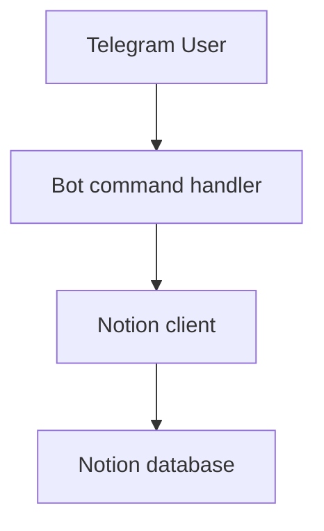
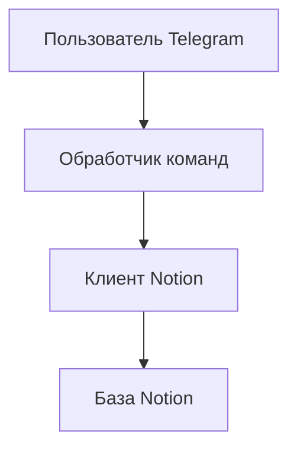

# TelegramToNotion

## English
## Problem
Teams often capture ideas/tasks in Telegram, but lose structure unless records are synchronized to a workspace database.
## Solution
TelegramToNotion bot receives commands and writes structured entries into a Notion database.
## Tech Stack
- Node.js
- Telegram Bot API
- Notion SDK
- dotenv
## Architecture
```text
index.js
package.json
netlify.toml
```

## Features
- `/start` onboarding
- `/addrecord <text>` command
- Record creation in Notion with author/date fields
## How to Run
```bash
npm install
cp .env.example .env
npm start
```

## Русский
## Проблема
Идеи и задачи из Telegram теряют структуру, если не синхронизируются в базу знаний.
## Решение
Бот TelegramToNotion принимает команды и создает структурированные записи в Notion Database.
## Стек
- Node.js
- Telegram Bot API
- Notion SDK
- dotenv
## Архитектура
```text
index.js
package.json
netlify.toml
```

## Возможности
- Онбординг через `/start`
- Команда `/addrecord <text>`
- Создание записей в Notion с автором и датой
## Как запустить
```bash
npm install
cp .env.example .env
npm start
```
